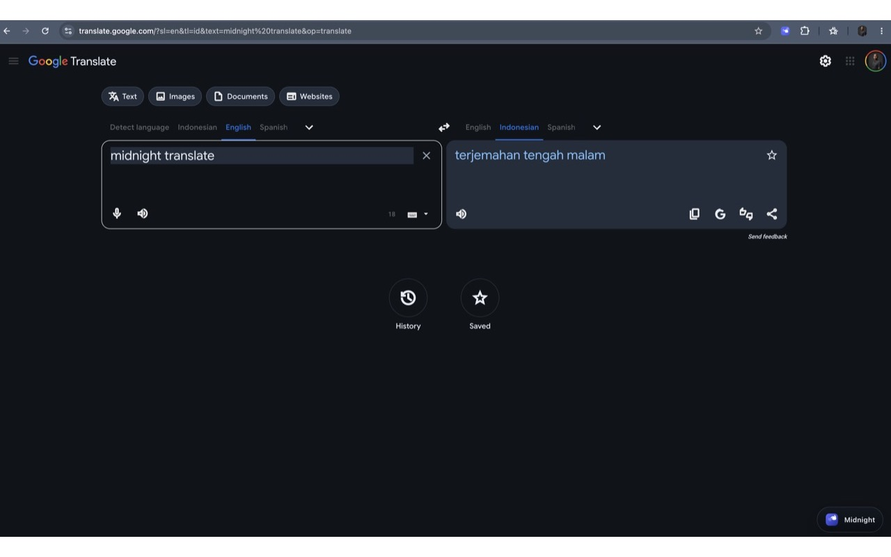

# Midnight Translate

Midnight Translate adds a soft midnight theme to Google Translate with a floating page toggle and accent color controls.



## What it does

- Adds a night theme to supported `translate.google.*` pages
- Places a floating `Midnight Translate` toggle on the page
- Lets you choose an accent color from the popup
- Saves theme state and accent color in Chrome storage sync

## Usage

1. Load as unpacked extension in Chrome
2. Open Google Translate
3. Use the floating page toggle to turn night mode on or off
4. Click the extension icon to change the accent color

## Install

```text
Chrome → chrome://extensions → Developer mode → Load unpacked → select this folder
```

## Permissions

- `storage` — save theme state and accent color
- Host access on supported `translate.google.*` domains — run the local content script on Google Translate pages

## Notes

- No analytics
- No remote code
- No external network requests
- Theme changes happen locally in the browser
