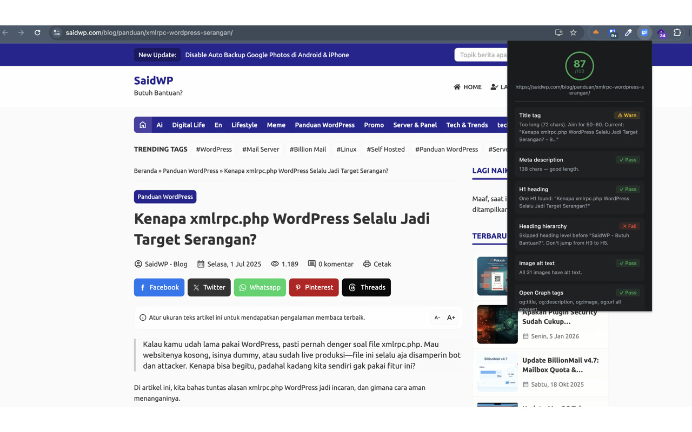

# SEO Shot

Instant on-page SEO snapshot. Score out of 100 with actionable fixes. No API needed — pure DOM scanning.



## What it checks

| Check | Detail |
|---|---|
| Title tag | Presence, length (50–60 optimal), content |
| Meta description | Presence, length (120–160 optimal) |
| H1 heading | Count (should be exactly 1) |
| Heading hierarchy | Starts with H1, no skipped levels (H1→H2→H3...) |
| Image alt text | % of images with an `alt` attribute |
| Open Graph tags | og:title, og:description, og:image, og:url |
| Twitter Card | card, title, description, image |
| Canonical URL | Presence, whether it self-references current path |
| Robots meta | index/noindex, follow/nofollow |
| Structured data | JSON-LD blocks and types |
| Mobile viewport | width=device-width |
| Language | html lang attribute |

## How scoring works

SEO Shot runs 12 checks on the current page only and converts them into a 0-100 heuristic QA score.

- Each check is worth up to 10 points
- Some warning states get partial credit instead of a full fail
- Final score is normalized to 100

This makes the score useful for quick page-level QA, not as a ranking predictor.

## What this score is and is not

SEO Shot is a heuristic on-page SEO checker.

- It is useful for reviewing real page output in the browser
- It is good for posts, landing pages, docs pages, and other individual URLs
- It is not a full-site crawler
- It is not a backlink, authority, or ranking tool
- It is not Google's ranking formula

## Usage

1. Load as unpacked extension
2. Navigate to any page
3. Click the extension icon
4. Get your score and checklist

## Known behavior

Archive pages, category listings, and tag pages typically score lower than single posts. This is expected: WordPress and similar CMS platforms rarely generate unique meta descriptions, OG tags, or optimized titles for archive views. SEO Shot scores what's actually on the page — low scores on archives are correct, not a bug.

## Why these checks

The checklist is based on common on-page SEO, search-appearance, and share-preview signals such as:

- title and snippet inputs
- canonical and robots directives
- structured data
- image alt text
- mobile viewport
- language markup

Relevant guidance:

- [Google Search Central: Title links](https://developers.google.com/search/docs/appearance/title-link)
- [Google Search Central: Snippets and meta descriptions](https://developers.google.com/search/docs/appearance/snippet)
- [Google Search Central: Canonical URLs](https://developers.google.com/search/docs/crawling-indexing/consolidate-duplicate-urls)
- [Google Search Central: Robots meta tags](https://developers.google.com/search/docs/crawling-indexing/robots-meta-tag)
- [Google Search Central: Structured data](https://developers.google.com/search/docs/appearance/structured-data/intro-structured-data)
- [Google Search Central: Image SEO](https://developers.google.com/search/docs/appearance/google-images)
- [MDN: `html lang`](https://developer.mozilla.org/en-US/docs/Web/HTML/Reference/Global_attributes/lang)

## Install

```
Chrome → chrome://extensions → Developer mode → Load unpacked → select this folder
```

## Permissions

- `activeTab` — scan the current page when you click the icon
- `scripting` — run the DOM scanner

No broad host permissions. SEO Shot only scans the active page after a user click.

**Zero external network calls. Zero data collection. No storage.**
